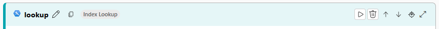

# LAB: Prompt flow Multi-round Chat on Your Data
Prompt flow, part of AI Studio, is a development tool designed to streamline the entire development cycle of AI applications powered by Large Language Models (LLMs). Prompt flow provides a comprehensive solution that simplifies the process of prototyping, experimenting, iterating, and deploying your AI applications.

In AI Studio there are a number of example flows that you can clone to experiment with, including the *Multi-Round Q&A on Your Data* flow. This flow creates a chatbot that uses an LLM and data from your own indexed files to ground multi-round question and answering capabilities in enterprise chat scenarios. 

This is a *RAG* process like the one pictured below where prompt flow is the *orchestrator* component.


**As a learning process, this lab walks you through the process of building up that RAG flow from scratch.**

> Creating these services may incur Azure usage costs.

> During this lab, save frequently by clicking the *Save* button in the top toolbar.

## Pre-requisites
1. An Azure subscription with contributor rights.
2. An AI Search instance with indexed data that you want to RAG over. If you don't have one already you can use this [learn article](https://learn.microsoft.com/en-us/azure/ai-services/openai/use-your-data-quickstart) to create it.
3. Access to [Azure AI Studio](https://ai.azure.com/).
4. The `Contributor` role for a *Hub* containing a *Project* in AI Studio.
5. A model deployed in your hub, e.g. gpt-4o.
6. Connections for your hub to the *AI Search* and *deployment* resources (see [here](https://learn.microsoft.com/en-us/azure/ai-studio/how-to/connections-add)).
7. A basic understanding of what Prompt flow is (see [here](https://learn.microsoft.com/en-us/azure/ai-studio/how-to/prompt-flow)).

## Open AI Studio
1. In AI Studio open your project, and select *Prompt flow* from the *Tools* menu on the left.
2. On the *Flows* page, click the *Create* button.
3. In the *Create new flow* window that opens, click the *Create* button for the *Chat flow* type. This will open the flow in Prompt flow.


## Overview
The Chat flow you have cloned is a template for creating a Q&A flow. At the top of the *Flow* pane you can see that the flow takes 2 inputs:
1. `chat_history` - a json structure containing the questions and answers in the chat so far.
2. `chat_input` - a user question.

And it returns one output:
1. `chat_output` - the response from the flow which is returned to the caller. Note that the value for this is set to be the output of the `chat` node.

*Nodes* are the building blocks of Prompt flow, they appear as panels below the *Inputs* and *Outputs* section. You can see that there is a default node called *chat* which is of type `LLM`. The purpose of an LLM node is to define a prompt, submit it to an LLM, and receive a response. Look at the *Inputs* section at the bottom of the node panel. You can see that it accepts the two parameters passed into the overall flow. The node declares a simple system message, loops through and appends the `chat_history`, and adds the input question `chat_input`. 

> Prompt flow uses a templating language called *jinja2* which lets you insert variables into your nodes at run-time.

## Run the flow
As it is, the flow will run, providing a chat with the configured LLM model.
1. To run the flow you will need to start a compute session. Click the `Start compute session` button at the top of the tool, it may take a minute to start.
> Running compute  may incur Azure usage costs.
2. At the top of the default LLM node:
    - Select your LLM connection, configured earlier. 
    - Leave the Api option as *chat*, 
    - select the model deployment configured as a connection earlier from the deployment_name list, 
    - set max_tokens to 300, 
    - and response_format to *text*.

    

3. Click the `Chat` button at the top of the screen, a chat panel should open down the right-hand side of the page.
4. Type a question such as "What is the capital of England?" into the chat input box at the bottom of the chat panel. 

After a moment you should see a response from the LLM in the chat panel. Review the *Outputs* section at the bottom of the LLM node, look at the *Input*, *Output*, *Trace*, and *Logs* tabs. This gives you information about what was passed to this node as input, what processing happened, and what the node created as output - this is very useful for debugging purposes!

## Create a prompt variant with hard-coded data
We are going to create 2 new nodes. The first, a *prompt variant* node will define a prompt with some hard coded context. The second, an *LLM* node will pass the prompt variant to the LLM and get a response.

### Create a prompt variant
A *Prompt* node lets you define a prompt, and create variants of that prompt with the intention of comparing their performance. We are going to create a prompt with some hard coded context data. Later we will replace this context with data from our AI Search service (aka the RAG pattern).
1. Click the `Prompt` button in the toolbar, a new empty Prompt node will appear below the *Chat* node. Scroll down to it, give it the name *Prompt_variants* and click *Add*.

2. The following code block defines a system message, adds some hard-coded *context* information about Covid-19, and the user question. Paste it into the new node.

```
system:
* You are an AI system designed to answer questions from users in a designated context. When presented with a scenario, you must reply with accuracy to inquirers' inquiries using only descriptors provided in that same context. If there is ever a situation where you are unsure of the potential answers, simply respond with "I don't know.
context: 
COVID-19 is a respiratory illness caused by the novel coronavirus, SARS-CoV-2, which first emerged in Wuhan, China, in late 2019. The disease quickly spread worldwide, leading to a global pandemic. Symptoms of COVID-19 can range from mild (fever, cough, fatigue) to severe (difficulty breathing, pneumonia), and in some cases, it can be fatal, especially among older adults or those with underlying health conditions.
COVID-19 is primarily transmitted through respiratory droplets when an infected person coughs, sneezes, or talks. It can also spread by touching surfaces contaminated with the virus and then touching the face, though this is less common. Preventive measures include wearing masks, practicing social distancing, handwashing, and vaccination.
Vaccines were developed rapidly and have been key in controlling the pandemic, reducing the severity of symptoms and preventing hospitalization.

chat history:

user:
{{ item.inputs.chat_input }}
assistant:
{{ item.outputs.chat_output }}



user:
{{ chat_input }}
```

3. Click the `Validate and parse input` button below the text area. This will perform some checks on your prompt and will result in the inputs expected by the prompt appearing as *node inputs* below - `chat_history` and `chat_input`.
4. Set the input values for the node:
    - Select *${inputs.chat_history}* for the `chat_history` parameter.
    - Select *${inputs.question}* for the `chat_input` parameter.

    

### Pass the prompt to the LLM
1. Click the `LLM` button in the toolbar, a new empty LLM node will appear below the *Prompt_variants* node. Scroll down to it, give it the name *chat_with_context* and click *Add*.
2. As before, set the LLM node properties for *connection*, *deployment_name*, *max_tokens*, and *response_format*.
3. The following code specifies the input parameter *prompt_text*. Paste it into the node.

```
{{prompt_text}}
```

4. Click the `Validate and parse input` button below the text area. The parameter `prompt_text` should appear in the inputs section of the node.
5. Select *${Prompt_variants.output}* for the `prompt_text` parameter.

    

6. Finally, scroll up to the very top of the panel past the 3 nodes, and set the output of this node to be the output of the overall flow by selecting *${chat_with_context.output}* for the *answer* parameter in the *Outputs* section. If you take a look at the *Graph* panel on the right-hand side of the workspace you should see the affect this has had on the flow - only the *Prompt_variants* and *chat_with_context* nodes contribute to the output.

    

7. Run the flow and enter a question such as "What is Covid-19". The response should be grounded in the hard coded context.

## Get data from your AI Search
Now we are going to replace the hard-coded data in the Prompt-variants node with data retrieved from AI Search. To do this, we will add 2 new nodes and edit our existing flow.

### Query the AI Search index
The `Index lookup` node type, found under the *More tools* toolbar button, lets us query AI Search.


1. Click the `Index lookup` button in the toolbar, a new empty Index lookup node will appear below the *chat_with_context* node. Scroll down to it, give it the name *lookup* and click *Add*.
2. Set the values of the node:
    - Set the value of *mlindex_content* to *Azure AI Search*. Doing this will display some additional text entry boxes.
        - Set *acs_index_connection* to the name of your registered AI Search connection.
        - Set *acs_index_name* to the AI Search index name.
        - Set *acs_content_field* to the content field in the index, e.g. `content`.
        - Set *acs_embedding_field* to the embeddings field, e.g. `contentVector`.
        - Set *acs_metadata_field* to the metadata field, e.g. `url`.
        - Set *semantic_configuration* to `default`.
        - Set *embedding_type* to `Azure OpenAI.
        - Set *aoai_embedding_connection* to the connection to your Azure OpenAI resource.
        - Set *embedding_deployment* to the embeddings model used, e.g. `text-embedding-ada-002`.
    - Set the value of *queries* to the output of the chat node *${chat.output}*.
    - Set the value of *query_type* to *Hybrid (vector + keyword)*.
    - Leave *top_k* as 3.

### Create a context block from the AI Search response
A `Python` node lets you run Python code in your flow to do things like process inputs and call APIs.
1. Click the `Python` button in the toolbar, a new empty Python node will appear below the *lookup* node. Scroll down to it, give it the name *generate_prompt_context* and click *Add*.
2. The following code processes the output of the AI Search query, building a string which contains the content and source. Paste it into the node.

```python
from typing import List
from promptflow import tool
from promptflow_vectordb.core.contracts import SearchResultEntity


@tool
def generate_prompt_context(search_result: List[dict]) -> str:
    def format_doc(doc: dict):
        return f"Content: {doc['Content']}\nSource: {doc['Source']}"

    SOURCE_KEY = "source"
    URL_KEY = "url"

    retrieved_docs = []
    for item in search_result:

        entity = SearchResultEntity.from_dict(item)
        content = entity.text or ""

        source = ""
        if entity.metadata is not None:
            if SOURCE_KEY in entity.metadata:
                if URL_KEY in entity.metadata[SOURCE_KEY]:
                    source = entity.metadata[SOURCE_KEY][URL_KEY] or ""

        retrieved_docs.append({
            "Content": content,
            "Source": source
        })
    doc_string = "\n\n".join([format_doc(doc) for doc in retrieved_docs])
    return doc_string
```

4. Click the `Validate and parse input` button below the text area. The parameter `search_result` should appear in the inputs section of the node.
5. Select *${lookup.output}* for the `search_result` parameter.


6. For a bit of clarity, let's re-order the nodes to reflect the execution order. Using the up arrow in the ribbon at the top of the nodes, shift the *lookup* node under the *chat* node, and the *generate_prompt_context* node under the *lookup* node.



### Modify the *chat* node to output an AI Search friendly query
Currently the *chat* node has the default simple prompt plus the chat history and user question. Let's modify it so that it takes the chat history and user question and gets the LLM to create a standalone question to query AI Search. 
1. Replace the existing code in the *chat* node with the following code:

```
system: 
* Given the following conversation history and the users next question,rephrase the question to be a stand alone question.
If the conversation is irrelevant or empty, just restate the original question.
Do not add more details than necessary to the question.

chat history: 
 
user: 
{{ item.inputs.chat_input }} 
assistant: 
{{ item.outputs.output }} 


Follow up Input: {{ chat_input }} 
Standalone Question:
```

2. Click the `Validate and parse input` button below the text area and make sure that the Inputs are still populated correctly.

### Modify the Prompt_variants node to use the AI Search output
Earlier we hard-coded context into the *Prompt_variants* node. Now we need to replace that with the actual context retrieved from AI Search.
1. Replace the existing code in the *Prompt_variants* node with the following code:

```
system:
* You are an AI system designed to answer questions from users in a designated context. When presented with a scenario, you must reply with accuracy to inquirers' inquiries using only descriptors provided in that same context. If there is ever a situation where you are unsure of the potential answers, simply respond with "I don't know.
Please add citation after each sentence when possible in a form "(Source: citation)".
context: {{contexts}}

chat history:

user:
{{ item.inputs.chat_input }}
assistant:
{{ item.outputs.chat_output }}



user:
{{ chat_input }}
```

2. Click the `Validate and parse input` button below the text area. You should see an additional *contexts* parameter. Set this to be the output of the *generate_prompt_context*, ${generate_prompt_context.output}. Looking at the graph, the final flow should look like the graph below.


## Retry getting a response from the LLM with real data
Finally, lets run through our RAG!
1. Run the flow and enter a question that could be answered by your grounding data in AI Search. You should get a response with citations.
